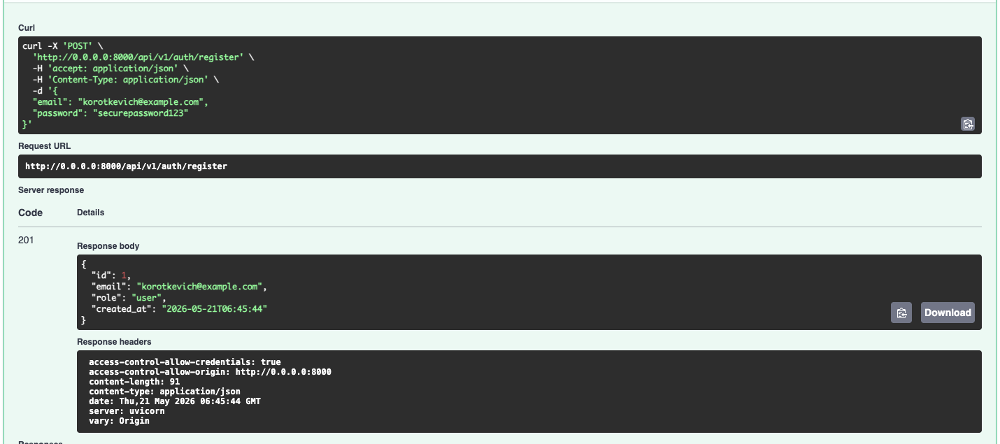
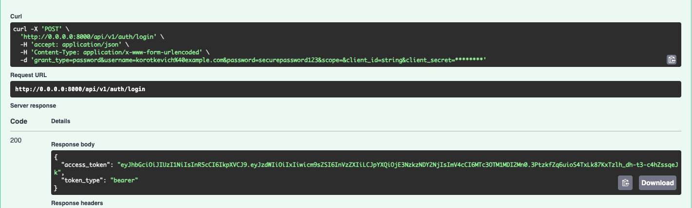
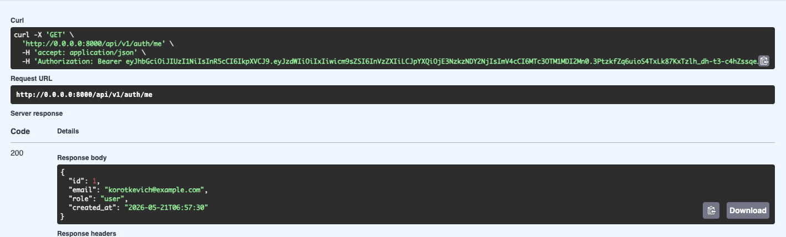
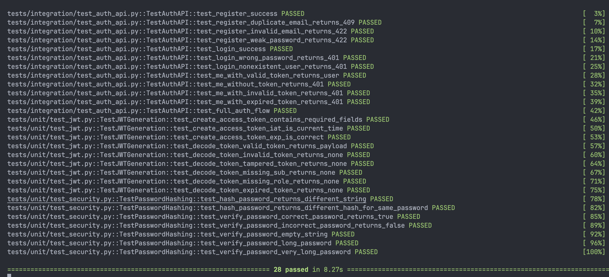

## Описание

Auth Service - это микросервис аутентификации и авторизации, предоставляющий RESTful API для регистрации пользователей, входа в систему и выдачи JWT токенов. Сервис является единственным источником выпуска токенов и управления пользователями в системе.

## Структура проекта

```
auth-service/
├── app/
│   ├── api/              # HTTP слой
│   │   ├── deps.py       # FastAPI зависимости
│   │   ├── routes_auth.py # Эндпоинты аутентификации
│   │   └── router.py     # Централизованная сборка роутеров
│   ├── core/             # Ядро приложения
│   │   ├── config.py     # Настройки (Pydantic Settings)
│   │   ├── security.py   # Функции безопасности (JWT, хеширование)
│   │   └── exceptions.py # HTTP исключения
│   ├── db/               # Слой данных
│   │   ├── base.py       # Базовый класс моделей
│   │   ├── session.py    # Управление сессиями БД
│   │   └── models.py     # ORM модели
│   ├── repositories/     # Репозитории
│   │   └── users.py      # Операции с пользователями в БД
│   ├── schemas/          # Pydantic схемы
│   │   ├── auth.py       # Схемы для аутентификации
│   │   └── user.py       # Публичные схемы пользователя
│   └── usecases/         # Бизнес-логика
│       └── auth.py       # UseCase аутентификации
├── tests/                # Тесты
│   ├── unit/            # Модульные тесты
│   └── integration/     # Интеграционные тесты
├── pyproject.toml       # Зависимости и настройки проекта
├── pytest.ini          # Настройки тестирования
└── .env                # Переменные окружения
```

## Быстрый старт
```
# Клонирование репозитория
cd auth-service

# Установка с использованием uv (рекомендуется)
uv sync

# Или с использованием pip
pip install -e .
```
## Настройка окружения
Создайте файл .env в корне проекта:
```
APP_NAME=auth-service
ENV=development

JWT_SECRET=your_super_secret_key_here_change_in_production
JWT_ALG=HS256
ACCESS_TOKEN_EXPIRE_MINUTES=60

SQLITE_PATH=./auth.db
```
## Запуск сервиса
```
# Запуск через uvicorn
uvicorn app.main:app --reload --host 0.0.0.0 --port 8000

# Запуск через Makefile
make project
```

## Доступ к документации

После запуска Swagger документация доступна по адресу:

- Swagger UI: http://0.0.0.0:8000/docs

- ReDoc: http://0.0.0.0:8000/redoc

## API Эндпоинты

#### 1. Регистрация пользователя

POST `/api/v1/auth/register`

Создает нового пользователя с указанными email и паролем.



#### 2. Вход в систему

POST `/api/v1/auth/login`

Аутентифицирует пользователя и возвращает JWT токен.



#### 3. Получение информации о текущем пользователе

GET `/api/v1/auth/me`

Возвращает публичные данные пользователя по JWT токену.



## Тестирование


